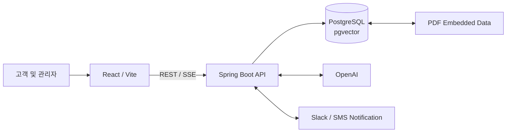
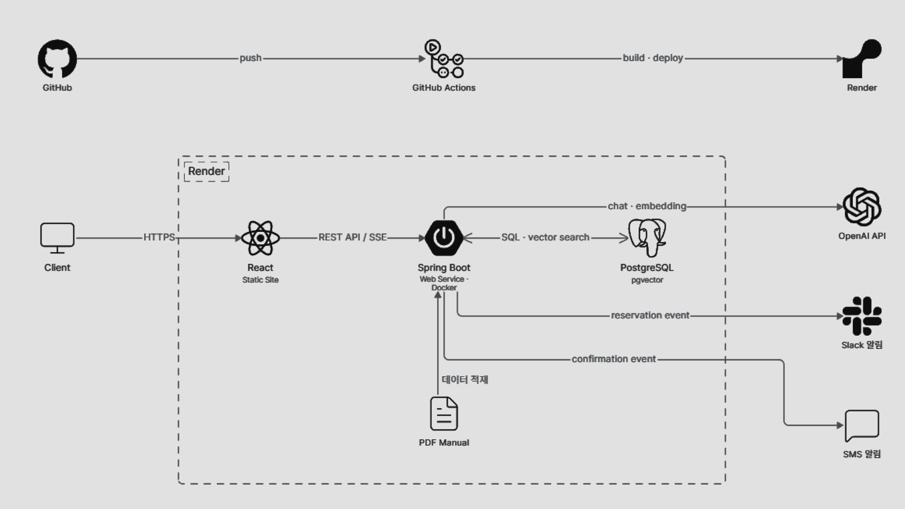

# 다케어 (DACARE)

## 개요

> 가전, IT 기기의 증상을 AI 상담으로 확인하고, 방문 수리 예약까지 연결하는 웹 서비스입니다.

<p align="center">
  
</p>

[서비스 바로가기](https://da-care-web.onrender.com)

[API 문서](https://da-care-api.onrender.com/docs)

---
## Project Demo

<p align="center">
  
</p>

---

## 주요 기능

- **AI 증상 상담**: OpenAI와 PDF 매뉴얼 검색(RAG)을 이용해 증상 관련 정보를 스트리밍으로 안내합니다.
- **예약 관리**: 회원과 비회원 모두 방문 수리를 예약하고, 예약 상태를 조회하거나 취소할 수 있습니다.
- **관리자 업무**: 관리자가 기사 정보를 관리하고 예약에 기사를 배정,완료,취소 처리합니다.
- **다국어 UI**: 한국어와 영어 화면을 제공합니다.
- **알림 연동**: 예약 이벤트에 Slack 및 SMS 알림을 전송합니다.

---

## 기술 구성

| 영역         | 구성                                                 |
|--------------|------------------------------------------------------|
| 프론트엔드   | React 19, TypeScript, Vite, Tailwind CSS             |
| 백엔드       | Java 25, Spring Boot 4, Spring Security, JPA, Flyway |
| AI           | Spring AI, OpenAI, pgvector 기반 매뉴얼 RAG          |
| 데이터베이스 | PostgreSQL 17, pgvector                              |
| 배포         | Render                                               |
| 개발 환경    | Docker Compose, pnpm, Gradle                         |

---

## 구성



<p align="center">
  
</p>

```text
da-care/
├── web/
│   └── src/
│       ├── components/  # 화면, UI 컴포넌트
│       ├── context/     # 인증, 언어 상태
│       ├── lib/
│       ├── locales/
│       └── assets/
├── server/
│   └── src/
│       ├── main/
│       │   ├── java/com/dacare/server/
│       │   │   ├── api/          # REST API와 API 문서
│       │   │   ├── config/       # 보안, CORS, Spring 설정
│       │   │   ├── domain/       # JPA 엔티티
│       │   │   ├── service/      # 예약, AI 상담 비즈니스 로직
│       │   │   ├── repository/   # 데이터 접근 계층
│       │   │   └── notification/ # Slack, SMS 알림 전송
│       │   └── resources/ # Spring 설정, Flyway, PDF Manual
│       └── test/        # 단위, 통합 테스트
├── infra/
│   ├── docker/          # Docker
│   └── render/          # Render Blueprint
├── docs/                # 프로젝트 관련 문서
├── .env.example         # 로컬 환경 변수 예시
└── README.md
```

---

## 로컬 환경 실행

### 사전 요구 사항

- Docker
- Java 25
- Node.js 22 및 pnpm 10
- OpenAI API 키 — AI 상담 기능 실행 시 필요

### 환경 변수 준비

프로젝트 루트에서 예시 파일을 복사합니다.

```powershell
Copy-Item .env.example .env
```

`.env`의 `JWT_SECRET`, 관리자 계정 정보, `OPENAI_API_KEY`를 로컬 환경에 맞게 변경합니다. 예시 값은 개발 전용이며 운영 환경에서 사용하면 안 됩니다.

### Docker Compose로 실행

PostgreSQL, API, 웹을 한 번에 실행합니다.

```powershell
docker compose -f infra/docker/docker-compose.dev.yml up --build
```

- 웹: `http://localhost:3000`
- API: `http://localhost:8080`
- API 문서(개발 프로필): `http://localhost:8080/docs`

종료와 볼륨 삭제는 다음 명령을 사용합니다.

```powershell
docker compose -f infra/docker/docker-compose.dev.yml down -v
```

### 개별 실행

먼저 PostgreSQL/pgvector 컨테이너를 시작합니다.

```powershell
docker run --name dacare-postgres -e POSTGRES_DB=dacare -e POSTGRES_USER=dacare -e POSTGRES_PASSWORD=change-database-password -p 5432:5432 -d pgvector/pgvector:pg17
docker exec dacare-postgres psql -U dacare -d dacare -c "CREATE EXTENSION IF NOT EXISTS vector;"
```

개별 실행 시 `.env`의 `DB_URL`을 `jdbc:postgresql://localhost:5432/dacare`로 변경한 뒤, 각각 실행합니다.

```powershell
Set-Location server
.\gradlew.bat bootRun
```

```powershell
Set-Location web
pnpm install --frozen-lockfile
pnpm dev
```

Vite 개발 서버는 `/api`, `/actuator` 요청을 로컬 API(`http://localhost:8080`)로 프록시합니다.

---

## 테스트 및 품질 확인

```powershell
Set-Location server
.\gradlew.bat test

Set-Location ..\web
pnpm lint
pnpm build
```

GitHub Actions CI는 다음을 검증합니다.

- 비밀값 노출 검사
- PostgreSQL 17, pgvector 컨테이너에서 Flyway, 벡터 저장소, 보안 경계를 포함한 서버 테스트
- 프론트엔드 lint 및 production build
- Render Blueprint 형식과 API Docker 이미지 빌드


---

## .env값 예시

개발 환경의 예시 설정입니다. 이 값을 그대로 운영 환경에 사용하지 마세요.

```dotenv
POSTGRES_DB=dacare
POSTGRES_USER=dacare
POSTGRES_PASSWORD=(change-database-password)
POSTGRES_PORT=5432

DB_URL=jdbc:postgresql://postgres:5432/dacare
DB_USERNAME=dacare
DB_PASSWORD=(change-database-password)

SERVER_PORT=8080
SPRING_PROFILES_ACTIVE=dev
JWT_SECRET=(replace-with-a-random-secret-of-at-least-32-bytes)
JWT_EXPIRATION=PT8H
ADMIN_EMAIL=admin@dacare.com
ADMIN_PASSWORD=admin1234
CORS_ALLOWED_ORIGINS=http://localhost:3000,http://localhost:5173

OPENAI_API_KEY=(replace-with-openai-api-key)
SLACK_WEBHOOK_URL=(replace-with-slack-webhook-url)

SOLAPI_API_KEY=(replace-with-solapi-api-key)
SOLAPI_API_SECRET=(replace-with-solapi-api-secret)
SOLAPI_SENDER=(replace-with-solapi-sender)
```
